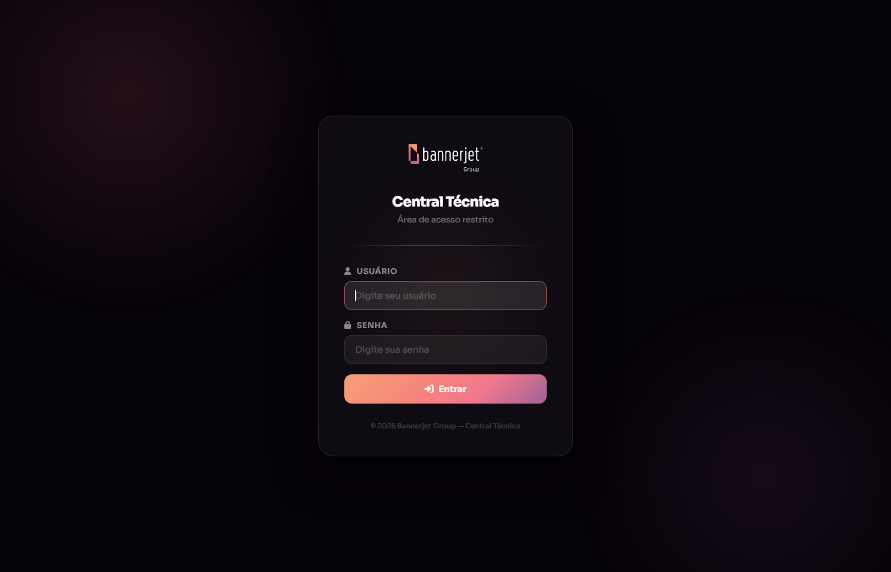
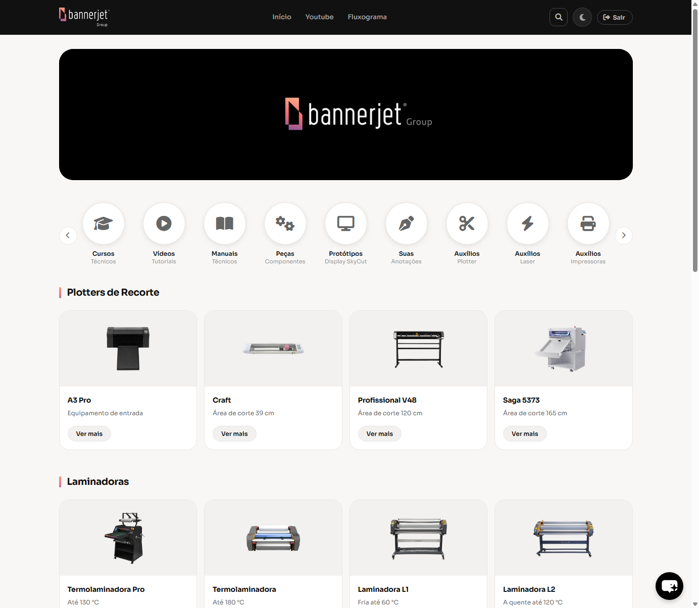

# Central Técnica — Bannerjet Group

Portal técnico interno para a **Bannerjet Group**, reunindo em um único lugar tudo que a equipe de suporte e os técnicos de campo precisam: catálogo dos equipamentos (plotters, laminadoras, impressoras UV/eco-solvente, laser), manuais, vídeos, peças, firmwares, auxílio para erros comuns e um curso técnico — com login e um chatbot de IA para tirar dúvidas.

🔗 **Portal:** [erickkadr.github.io/Central-Tecnica-Bannerjet](https://erickkadr.github.io/Central-Tecnica-Bannerjet/) *(acesso restrito — requer login)*

## Prints

<div align="center">
  
  <br /><br />
  
</div>

## Sobre o projeto

A Bannerjet Group revende e dá suporte técnico a uma linha grande de equipamentos de comunicação visual — plotters de recorte, laminadoras, impressoras UV, eco-solvente, laser CO₂/fibra, guilhotinas etc. Antes desse portal, o conhecimento técnico (manuais, parâmetros de corte, erros comuns, firmwares) ficava espalhado. A Central Técnica organiza tudo isso em um hub único, por categoria e por equipamento, com login de acesso restrito à equipe.

## Motivação

Centralizar o suporte técnico interno da empresa: reduzir o tempo que um técnico gasta procurando um manual, parâmetro de corte ou firmware antigo, e criar uma base de conhecimento que cresce junto com o portfólio de equipamentos da empresa — incluindo um assistente de IA (chatbot) treinado para responder dúvidas técnicas direto no site.

## Funcionalidades

- **Login com área restrita** — conteúdo só é acessado após autenticação
- **Catálogo de equipamentos** organizado por categoria (plotters de recorte, laminadoras, impressoras UV/eco-solvente, laser, guilhotinas) com página própria para cada modelo
- **Cursos técnicos** e **vídeos tutoriais**
- **Manuais técnicos** e **catálogo de peças/componentes**
- **Central de firmwares** e **perfis de cor**
- **Auxílio de erros comuns** (plotter, laser, impressoras) e **anotações**
- **Chatbot com IA** (Chatbase) para suporte instantâneo
- **Modo claro/escuro** com preferência salva no navegador
- Link direto para o canal do YouTube da empresa e para o fluxograma de atendimento (Miro)

## Tecnologias

- **HTML5, CSS3 e JavaScript puro** — sem framework, sem build step
- **localStorage** para sessão de login e preferência de tema
- **Chatbase** (widget de chatbot com IA) via script embutido
- **GitHub Pages** para hospedagem

## Estrutura do projeto

```
Central-Tecnica-Bannerjet/
├── index.html              # Dashboard principal (protegido por login)
├── login.html               # Autenticação
├── curso-tecnico.html       # Cursos técnicos
├── videos.html               # Vídeos tutoriais
├── manuais.html               # Manuais técnicos
├── pecas.html                  # Catálogo de peças
├── firmwares.html               # Firmwares por equipamento
├── perfil-cores.html             # Perfis de cor
├── auxilio-plotter.html           # Erros comuns — plotter
├── auxilio-laser.html              # Erros comuns — laser
├── auxilio-impressoras.html         # Erros comuns — impressoras
├── anotacoes.html                    # Anotações da equipe
├── [equipamento].html                # Uma página por modelo (A3.html, craft.html,
│                                        laminadora-l1.html, uv-90cm.html, etc.)
├── script.js                # Autenticação, tema, navegação
├── style.css                 # Design system do portal
└── images/                    # Fotos dos equipamentos e identidade visual
```

## Como rodar localmente

Sem build, sem dependência — sirva a pasta com qualquer servidor estático:

```bash
npx serve .
```

> O portal exige login (`login.html`) — a sessão fica salva em `localStorage` no navegador.

---

### Made with ♥ by Erick Dantas | [Contato](https://www.linkedin.com/in/erickkadr/)
